<h1 align="center">🚀 UniFlux </h1>


## 🌐 **AI-Powered Smart University Management & Timetable Optimization Platform**

<div align="center">
  
</div>


<div align="center">
  <br><br>
  <p align="center">
    <b>🎉 This project is now OFFICIALLY accepted for ECWOC 2026</b>
    <br><br>
    <b>🌍 Open Source Program | 🚀 Real Projects | 💡 Real Impact</b>
    <br><br>
    <b>🏆 Elite Coders Winter of Code (ECWOC 2026)</b>
    <br><br>
  </p>
</div>


<div align="center">
  
  <br><br>

  <h3>🧠 What is UniFlux?</h3>

  <p>
    <strong>UniFlux</strong> is a <strong>modern, AI-assisted, open-source web platform</strong> built to 
    <strong>digitally manage, automate, and optimize university academic operations</strong>.
  </p>

  <p>
    The platform focuses on <strong>intelligent timetable generation</strong>, 
    <strong>faculty workload balancing</strong>, and 
    <strong>centralized academic management</strong>—designed specifically for 
    <strong>multi-department, multi-branch universities</strong>.
  </p>

  <p>
    UniFlux replaces <strong>manual scheduling, spreadsheets, and fragmented tools</strong> with a 
    <strong>single unified intelligent system</strong> that is 
    <strong>fast, flexible, scalable</strong>, and fully 
    <strong>aligned with NEP 2020 requirements</strong> 🚀🎓
  </p>
</div>


  <p>
    <strong>UniFlux</strong> is a <strong>modern, AI-assisted, open-source web platform</strong> built to 
    <strong>digitally manage, automate, and optimize university academic operations</strong>.
  </p>

<!---**_Frontend is fully working_**
**_Backend is fully working_**
**_Google Authentication is fully working_** -->

**_🚧 Important Note: Before you start working, check the GitHub repository branch._** <br>
**_🔄 First: Sync (pull) to the latest merged code from the main branch._** <br>
**_✅ Then: Start working on your assigned issue or feature._**


**_⚠ Skipping this step can cause merge conflicts and your PR may be rejected._**

<!---**_🚧 Important Note: login, registration, or Google authentication system Everything is working properly._**-->

**_⚠ Do NOT remove or change any existing code unrelated to your issue! If your PR modifies or deletes any core code without a valid reason, it will not be merged._**

**_🚫 Strict Rule: Do NOT bypass the <!---login, registration, or Google authentication--> system. If any such activity is found, you will be removed and reported from this project._**

---

> ⚠️ **IMPORTANT WARNING:**  
> 💡 **Before pushing your changes, make sure to _switch to the correct branch_ first!** 🪄  
>  
> 🔴 **Commands to Follow:**  
> ```bash
> git checkout <branch-name>    # 🔁 Switch to your assigned branch
> git pull origin <branch-name> # ⬇️ Pull latest updates
> git add .                     # ➕ Add your changes
> git commit -m "your message"  # 💬 Commit with a clear message
> git push origin <branch-name> # 🚀 Push your code safely
> ```
> 🧠 **Tip:** Always double-check the branch before pushing to avoid merge conflicts! ⚡  

---


<h3 📊 Project Insights</h3>

<table align="center">
  <thead align="center">
    <tr>
      <td><b>🌟 Stars</b></td>
      <td><b>🍴 Forks</b></td>
      <td><b>🐛 Issues</b></td>
      <td><b>🔔 Open PRs</b></td>
      <td><b>🔕 Closed PRs</b></td>
      <td><b>🛠️ Languages</b></td>
      <td><b>👥 Contributors</b></td>
      <td><b>📦 Repo Size</b></td>
      <td><b>🕒 Last Commit</b></td>
      <td><b>📈 Commit Activity</b></td>
    </tr>
  </thead>
  <tbody align="center">
    <tr>
      <td>
        
      </td>
      <td>
        
      </td>
      <td>
        
      </td>
      <td>
        
      </td>
      <td>
        
      </td>
      <td>
        
      </td>
      <td>
        
      </td>
      <td>
        
      </td>
      <td>
        
      </td>
      <td>
        
      </td>
    </tr>
  </tbody>
</table>

<hr>


<h2 align="center">🎯 Open Source Programmes ⭐</h2>

🌟 **Big Announcement Ahead!**

### 🏆 Elite Coders Winter of Code (ECWOC 2026)

We’re excited to open the doors to a global community of innovators, learners, and builders for **Elite Coders Winter of Code (ECWOC 2026)** — a flagship open-source initiative focused on **real-world impact, skill acceleration, and collaborative growth** 🚀🌍

ECWOC 2026 brings together **students, developers, designers, and tech enthusiasts** from across India and beyond to work on **production-ready open-source projects**, guided by experienced mentors and driven by a strong culture of learning and contribution 💻✨

This program is designed to go beyond tutorials and theory. Here, contributors gain **hands-on experience**, work on **meaningful problem statements**, and understand how real software is designed, built, reviewed, and shipped in collaborative environments 🧠⚙️

💡 **Why ECWOC 2026?**
Because this is where **code meets purpose**. Participants don’t just write code—they:

* Build scalable, industry-relevant solutions
* Learn best practices in version control, documentation, and clean architecture
* Collaborate in diverse teams across domains and skill levels
* Grow through mentorship, reviews, and continuous feedback

🌈 **What contributors gain**
✨ Exposure to modern tech stacks (Web, AI/ML, Cloud, DevOps & more)
🤝 Open-source collaboration experience on real projects
🧠 Strong foundations in teamwork, leadership, and problem-solving
🎯 Participation in structured milestones, sprints, and reviews
🏆 Recognition, certificates, and program credentials
🌍 Networking with peers, mentors, and open-source leaders

🌍 **Elite Coders Winter of Code is more than a seasonal program.**
It’s a community-driven movement that nurtures talent, encourages knowledge sharing, and empowers contributors to create technology that matters 💫

🎉 Whether you’re taking your **first step into open source** or looking to **mentor and lead**, ECWOC 2026 offers a space to learn, contribute, and grow together.

❤️ We’re excited to welcome you to **Elite Coders Winter of Code 2026** —
where curiosity turns into contribution, and contribution turns into impact.
Let’s build the future, one meaningful commit at a time ❄💻🚀


> ⚠️⚠️ **📢 IMPORTANT NOTICE — PLEASE READ CAREFULLY BEFORE CONTRIBUTING!** ⚠️⚠️  

<details>
  <summary>📘 Click to Read More </summary>

## ✅ **Current Project Status (UniFlux)**

* 🧱 **Project initialized from scratch** with a clean and scalable structure
* 🔐 **Role-based authentication flow planned** (Admin / Department / Faculty)
* 🎨 **Modern UI foundation** using TypeScript & Tailwind CSS
* 🔗 **Clear separation of modules** for easy contribution and scaling

> 🚧 The project is in **active development**. Core features will be built step-by-step through open-source contributions.

---

## ⚠️ **Important Guidelines for Contributors**

### 🔐 **Before You Start**

➡️ Please **read the complete `README.md` carefully** before picking an issue.
➡️ Understand the **project vision, roadmap, and coding standards**.

### 🚫 **Code Safety Rules**

* ❌ Do **not modify or delete existing core code** without discussion
* ❌ Avoid unrelated refactors in your PR
* ❗ PRs that change core logic **without valid justification will not be merged**

---

## 🧭 **How to Contribute Successfully**

* 📌 Pick an issue that matches your skill level
* 💬 Ask questions in the issue or discussion if unsure
* 🧪 Test your changes before submitting a PR
* 📝 Write clear commit messages and PR descriptions

This helps:

* 🚀 Faster PR reviews
* 🔁 Fewer merge conflicts
* 🤝 Better collaboration

---

## 🚨 **Attention Contributors!**

📖 Please make sure you understand:

* 🏛️ What **UniFlux** aims to build
* 🧠 How the **Smart Timetable & University Management system** works
* 🔐 Basic **security & best practices**
* 🤝 Contribution workflow and expectations

🔁 This ensures your contribution fits perfectly into the project vision.

---

## 🎯 **Vision**

To build an **open-source, AI-powered university management platform** that simplifies academic operations, enables smart timetable optimization, balances faculty workload, and supports multidisciplinary education under NEP 2020 — all through a **modern, scalable, and contributor-friendly system**.

---

## 💖 **Community Note**

Let’s build **UniFlux** together —
🎓 smarter universities
⚡ efficient academic systems
🌍 and a welcoming open-source community for everyone.

</details>

<details>
  <summary>📘 Click to Read More </summary>

## 🔄 Contribution Workflow (UniFlux)

### 📌 **Visual Workflow Diagram**

> ✅ You can paste this directly into `README.md` (GitHub supports Mermaid)

```mermaid
flowchart TD
    A[👋 Contributor Reads README.md] --> B[🔍 Browse Issues]
    B --> C{Issue Assigned?}
    C -- No --> D[📝 Comment to Request Assignment]
    D --> C
    C -- Yes --> E[🍴 Fork the Repository]
    E --> F[🌿 Create a New Branch]
    F --> G[💻 Make Code Changes]
    G --> H[🧪 Test Locally]
    H --> I[📦 Commit Changes]
    I --> J[🚀 Push Branch to Fork]
    J --> K[🔁 Create Pull Request]
    K --> L{Admin Review}
    L -- Changes Requested --> G
    L -- Approved --> M[✅ PR Merged 🎉]
```



---

## 🧭 Contribution Workflow Explained (Simple Steps)

### 👋 **Step 1: Read the README**

📖 Understand:

* Project vision (UniFlux)
* Folder structure
* Coding rules
* Contribution guidelines

---

### 🔍 **Step 2: Pick an Issue**

* Browse open issues
* Choose one based on your skill level:

  * 🟢 Beginner
  * 🟡 Intermediate
  * 🔴 Advanced

---

### 📝 **Step 3: Get the Issue Assigned**

💬 Comment on the issue:

> “I would like to work on this issue.”

⚠️ Do **not** start without assignment.

---

### 🍴 **Step 4: Fork the Repository**

Create your own copy of the UniFlux repository.

---

### 🌿 **Step 5: Create a Branch**

```bash
git checkout -b feature/issue-name
```

---

### 💻 **Step 6: Make Your Changes**

* Follow existing code style
* Do not touch unrelated files
* Keep changes focused on the issue

---

### 🧪 **Step 7: Test Your Code**

✔ Ensure:

* No build errors
* No broken UI
* Feature works as expected

---

### 📦 **Step 8: Commit Your Changes**

```bash
git commit -m "Fix: added timetable UI validation"
```

---

### 🚀 **Step 9: Push to Your Fork**

```bash
git push origin feature/issue-name
```

---

### 🔁 **Step 10: Create a Pull Request**

📝 Include:

* Issue reference
* What you changed
* Screenshots (if UI-related)

---

### 🔍 **Step 11: Review Process**

* Admin reviews PR
* Feedback may be given
* Make changes if requested

---

### ✅ **Step 12: PR Merged 🎉**

Congratulations!
Your contribution is now part of **UniFlux** 🚀🎓

---

## 🚨 Important Rules

* ❌ No direct commits to `main`
* ❌ No unrelated refactors
* ❌ No core logic changes without discussion
* ✅ Clean, focused PRs only

---

## 💖 Final Note

Open-source is about **learning + collaboration**.
Even small contributions matter 💙
  
</details>

<details>
  <summary>📘 Click to Read More </summary>

  ## 🔐 Access Roles & Permissions

### 👑 1. **Super Admin**

- Full access to all modules and roles.
- Can create/manage departments, courses, subjects, users.
- Assign roles (teacher, student, HOD, etc.)
- View analytics (overall performance, attendance, top scorers, etc.)
- Moderate academic calendar and result publishing.

### 🧑‍💼 2. **Higher Authorities (HOD, Principal)**

- Can access departmental or university-wide reports.
- Approve results before publishing.
- View student performance and teacher activities.
- Monitor attendance reports and progress summaries.

### 👩‍🏫 3. **Teacher Panel**

- Create assignments and upload marks.
- Manage attendance (daily/subject-wise).
- Enter internal/external marks and update results.
- View academic calendar and class schedule.

### 🎓 4. **Student Panel**

- View personal dashboard with attendance, marks, and result history.
- Get notifications for results, assignments, and exams.
- Submit feedback and raise grievances.
- Download mark sheets and assignment materials.

---

## 📚 Core Modules & Features

### 1️⃣ **Authentication & Role-Based Authorization**

- Secure login/signup for each role.
- JWT/session-based authentication.
- Role-based access control (RBAC) for routing and permissions.

---

### 2️⃣ **User Management**

- Super Admin can add/manage all users.
- Auto-generate university email IDs and registration numbers.
- Profile section for all users with edit restrictions per role.

---

### 3️⃣ **Department & Course Management**

- Create and assign:

  - Faculties/Departments (e.g., CSE, EEE, ME)
  - Programs (B.Tech, M.Tech, etc.)
  - Subjects with semester tagging
  - Teachers assigned to courses

---

### 4️⃣ **Result Management System**

- Teachers enter internal and external marks per subject.
- Marks auto-calculated for grade (CGPA/SGPA/percentage).
- Grade logic: based on predefined scale (A+, A, B, etc.)
- HOD reviews and approves results before publishing.
- Students view results semester-wise.
- Result PDF export and digital signature system.

---

### 5️⃣ **Attendance Management**

- Mark attendance daily (subject-wise).
- Auto percentage calculation.
- Students can track monthly attendance.
- Color-coded attendance tracker.

---

### 6️⃣ **Exam & Timetable Management**

- Create internal and external exam schedules.
- Notify students and faculty.
- Automated exam seat allocation (optional).

---

### 7️⃣ **Grievance & Feedback System**

- Students can submit feedback or grievances.
- Admin and faculty can respond.
- Ticket-based resolution tracking.

---

### 8️⃣ **Academic Calendar & Notices**

- Upload holiday lists, exam dates, deadlines.
- Department-wise notice board system.
- Push notifications to students and teachers.

---

### 9️⃣ **Dashboard & Reports**

- **Super Admin**: Overview of all data with charts (Bar, Pie, Line)
- **HODs/Teachers**: Class-wise performance trends
- **Students**: Personalized dashboard with progress, alerts, etc.

---

### 🔧 Bonus Features

- **Email/SMS Notifications** for result release, exam alerts.
- **Student Certificates**: Bonafide, Transfer, etc. request and generation.
- **Dark Mode** toggle for better UX.
- **Multi-language support** (optional).

---

## 🧪 Test Users (for mock/demo)

| Role        | Email                                                                 | Password |
| ----------- | --------------------------------------------------------------------- | -------- |
| Super Admin | [superadmin@campuscore.in](mailto:superadmin@campuscore.in)           | admin123 |
| HOD (CSE)   | [hod.cse@campuscore.in](mailto:hod.cse@campuscore.in)                 | hod123   |
| Teacher     | [teacher.rahul@campuscore.in](mailto:teacher.rahul@campuscore.in)     | teach123 |
| Student     | [student.22CS123@campuscore.in](mailto:student.22CS123@campuscore.in) | stud123  |

---

## 📌 Deployment Recommendations

- **Frontend**: Host on Vercel or Netlify
- **Backend**: Deploy with Render, Railway, or DigitalOcean
- **Database**: MongoDB Atlas for scalable document-based data
- **File Storage (if needed)**: Cloudinary or Firebase Storage for PDFs, images

---

## 📋 Extended Functionality for CampusCore

---

### 🎓 1. **Student Management (10 Students Example)**

Each student will have:

- Name, Email, Roll Number, Department, Semester
- Registration No (e.g., `22CS101`)
- Auto-generated login credentials

```json
[
  { "name": "Amit Das", "roll": "22CS101", "email": "amit@campuscore.in", "semester": 5 },
  { "name": "Priya Rani", "roll": "22CS102", "email": "priya@campuscore.in", "semester": 5 },
  ...
  { "name": "Sneha Mehra", "roll": "22CS110", "email": "sneha@campuscore.in", "semester": 5 }
]
```

---

### 📚 2. **Subject Management (6 Subjects Example)**

Each subject has:

- Subject Code, Name, Assigned Teacher, Semester

```json
[
  { "code": "CS501", "name": "Operating Systems", "teacher": "Rahul Mehra" },
  { "code": "CS502", "name": "DBMS", "teacher": "Meena Rathi" },
  { "code": "CS503", "name": "Computer Networks", "teacher": "Aman Raj" },
  {
    "code": "CS504",
    "name": "Software Engineering",
    "teacher": "Kavita Joshi"
  },
  { "code": "CS505", "name": "AI & ML", "teacher": "Manoj Kumar" },
  { "code": "CS506", "name": "Web Development", "teacher": "Sakshi Bhatia" }
]
```

---

### 🧑‍🏫 3. **Teacher Panel (6 Teachers)**

Each teacher has:

- Name, Email, Assigned Subject, Login Access

```json
[
  { "name": "Rahul Mehra", "email": "rahul@campuscore.in" },
  { "name": "Meena Rathi", "email": "meena@campuscore.in" },
  ...
]
```

---

### 🕒 4. **Class Timetable (5 Days – Mon to Fri)**

Example Timetable (for Semester 5):

| Day       | 9–10 AM       | 10–11 AM | 11–12 PM      | 1–2 PM        | 2–3 PM  |
| --------- | ------------- | -------- | ------------- | ------------- | ------- |
| Monday    | OS            | DBMS     | Web Dev       | CN            | AI      |
| Tuesday   | CN            | AI       | Software Engg | Web Dev       | DBMS    |
| Wednesday | Software Engg | DBMS     | OS            | CN            | Web Dev |
| Thursday  | AI            | OS       | DBMS          | Software Engg | CN      |
| Friday    | Web Dev       | CN       | AI            | OS            | DBMS    |

---

### ✅ 5. **Attendance Management (5-Day Record)**

- Attendance can be stored per subject per day
- Mark as `Present` or `Absent` for each class

```json
{
  "student": "22CS101",
  "subject": "CS501",
  "date": "2025-07-01",
  "status": "Present"
}
```

Teachers can view attendance history and percentage per subject.

---

### 🧾 6. **Marks Management**

Separate pages for:

#### a. **Internal Marks Entry**

- Test 1, Test 2, Assignments
- Entry by teachers
- Max Marks: 30

#### b. **External Marks Entry**

- Final University Exam marks
- Max Marks: 70
- Locked once submitted

#### c. **Semester-wise Result Page**

- Combines internal + external = 100 marks
- Grade (A+, A, B...) auto-calculated
- GPA/CGPA logic applied

---

### 📄 7. **PDF Result Generation & Download**

- Results page for each student
- **“Download Marksheet”** button
- Includes:

  - Student info
  - Subject-wise marks (internal, external, total, grade)
  - Overall GPA/CGPA
  - QR Code for verification (optional)
  - Auto digital signature

✅ Generated using libraries like `pdf-lib`, `jspdf`, or server-rendered PDFs

Example Marksheet Layout:

-----------------------------------------
           CAMPUSCORE UNIVERSITY
         Semester V Grade Sheet - 2025
-----------------------------------------
Name: Amit Das       Roll: 22CS101
Program: B.Tech CSE  Semester: V

Subjects:
-----------------------------------------
Subject              Int   Ext  Total  Grade
Operating Systems     25    65    90     A+
DBMS                  24    62    86     A
Computer Networks     20    60    80     A
...
-----------------------------------------
SGPA: 8.95
Result: PASS
-----------------------------------------
Date: 06/07/2025   Principal Sign: ____

---

## 📌 Extra Suggestions (Optional)

- Export attendance to Excel
- Add a Student Report Card PDF archive for each semester
- Auto email result PDF to students on publish
- Add a semester history timeline in student dashboard


</details>


### 🔒 _Strict Contribution Guidelines (Must Follow):_

❗ YOU ARE *NOT ALLOWED TO:

🔴 ❌ You are NOT allowed to change or update any existing backend files or original code.

🔴 ❌ You are NOT allowed to update or modify any existing routes or their logic in any form.

🔴 ❌ You are NOT allowed to change the project structure or delete/edit core files without permission.

🔴 ❌ You are NOT allowed to add or push any .env, .env.local, or sensitive environment files to the frontend OR backend.


## 🔧 Tech Stack

| Layer            | Tech Used |
|------------------|-----------|
| Frontend         | TypeScript, JavaScript (ES6+), Tailwind CSS, Vite |
| Backend          | JavaScript, Node.js, Express |
| Database         | MongoDB (Local/Atlas) |
| Authentication  | JWT (Role-based access control) |
| Real-time        | Socket.IO |
| Optimization    | Rule-based scheduling & constraint logic |
| Analytics       | Chart.js / JS-based visualization |
| APIs             | Custom REST APIs |
| Tooling         | Git, GitHub, VS Code |
| Hosting          | Vercel (Frontend), Render (Backend) |


<details>
  <summary>📘 Click to Read More </summary>

# 📐 Architecture Diagram

UniFlux follows a **clean, scalable frontend–backend architecture** designed for real-world university systems.

---


---

### 🧩 Architecture Highlights

* Clear **separation of concerns**
* Secure **role-based access**
* Scalable for **multi-department universities**
* Open-source friendly structure

---

# 🔄 Data Flow Chart

This shows how data moves through UniFlux during a **typical authenticated workflow**.


### 📌 Key Flow Principles

* Frontend never accesses database directly
* Backend enforces **authorization & validation**
* All sensitive logic stays on the server

---

# 📦 Module-Wise Tech Mapping

| Module             | Responsibility                   | Tech Used                |
| ------------------ | -------------------------------- | ------------------------ |
| Authentication     | Login, roles, protected routes   | JWT, Express Middleware  |
| User Management    | Admin, Dept Admin, Faculty roles | Node.js, MongoDB         |
| Timetable Input    | Subjects, faculty, rooms, slots  | TypeScript, Tailwind     |
| Timetable Engine   | Schedule generation & checks     | Rule-based JS logic      |
| Conflict Detection | Clash identification             | Backend validation logic |
| Rearrangement      | Alternate slot suggestions       | Constraint logic         |
| Dashboards         | Workload & utilization views     | Chart.js / JS Charts     |
| Result Management  | SGPA / CGPA processing           | Backend logic            |
| API Layer          | Data exchange                    | REST APIs                |
| Deployment         | Hosting & CI                     | Vercel, Render           |

---

# 🧠 Optimization Logic Explanation

UniFlux uses a **rule-based optimization approach** (easy to understand, extend, and open-source friendly).

### 🎯 Core Constraints Considered

* Faculty availability
* Classroom & lab capacity
* Subject credit requirements
* Max classes per day/week
* Fixed slots (labs, seminars)
* Multi-department overlaps

---

### ⚙️ Optimization Workflow


---

### ✅ Why Rule-Based (Instead of Heavy AI)?

* Transparent & explainable logic
* Easier for contributors to understand
* Faster to debug
* Can later be upgraded to AI/ML models

---

### 🔮 Future Enhancement Path

* AI-assisted preference learning
* Predictive faculty availability
* Optimization scoring system
* Genetic / heuristic algorithms

</details>


## 🚀 Features Implemented

- ✅ **MongoDB Integration**: Full database integration replacing mock data
- ✅ **Real-time Updates**: Socket.IO for live data synchronization
- ✅ **Role-based Authentication**: Secure login for Super Admin, HOD, Teacher, and Student
- ✅ **CRUD Operations**: Full Create, Read, Update, Delete functionality for all entities
- ✅ **Real-time Dashboard**: Live updating of student, teacher, subject, attendance, marks, grievances, and notices

## 🧑‍🤝‍🧑 Open Source Roles (UniFlux)

| Role                     | Responsibility |
|--------------------------|----------------|
| 🎨 Frontend Lead         | Build responsive dashboards, timetable UI, result views using TypeScript & Tailwind CSS |
| 🖥️ Backend Lead          | Design REST APIs, authentication, role-based access, and academic data handling |
| 🧠 Optimization Engineer | Implement timetable rules, clash detection, workload balancing, rearrangement logic |
| 📊 Analytics Engineer    | Faculty workload, classroom utilization, result analytics & charts |
| 🔐 Security Engineer     | JWT auth flow, role permissions, API protection, validation |
| 🎨 UX / UI Designer      | User flows, accessibility, clean academic-focused UI/UX |
| 🧪 QA Tester             | Feature testing, edge-case validation, bug reporting |


### 🙌 **Thank You, Contributors!**

> Thank you once again to all our contributors! Your efforts are truly appreciated. 💖👏

<p align="center">
  <a href="https://github.com/abhisek2004/Dev-Elevate/graphs/contributors">
   
  </a>
</p>


## 🧩 Contributions


### ⭐ Stargazers

<div align="center">
  <a href="https://github.com/abhisek2004/UniFlux/stargazers">
    
  </a>
</div>

---

### 🍴 Forkers

<div align="center">
  <a href="https://github.com/abhisek2004/UniFlux/network/members">
    
  </a>
</div>


## 🌐 Connect with Me

<p align="center">
  
</p>

- 👨‍💻 **Website Creator:** [Abhisek Panda](https://abhisekpanda072.vercel.app)
- 🐙 **GitHub:** [abhisek2004](https://github.com/abhisek2004)
- 💼 **LinkedIn:** [abhisekpanda2004](https://www.linkedin.com/in/abhisekpanda2004/)


<div align="center">
  
</div>


<div align="center">

<h3>👨‍💻 Built with ❤️ by the UniFlux Team</h3>

<a href="https://github.com/abhisek2004/UniFlux/issues">Open an Issue</a> | 
<!-- <a href="https://youtu.be/zCUTFe8gQEA?si=bS5lkWOxnIuJMXst">Watch Demo</a> |  -->
<a href="https://develevate-ai.vercel.app">Live</a>

</div>


<div align="right">

🔝 [**Back to Top**](#top)

</div>

<p align="center">
  
</p>
