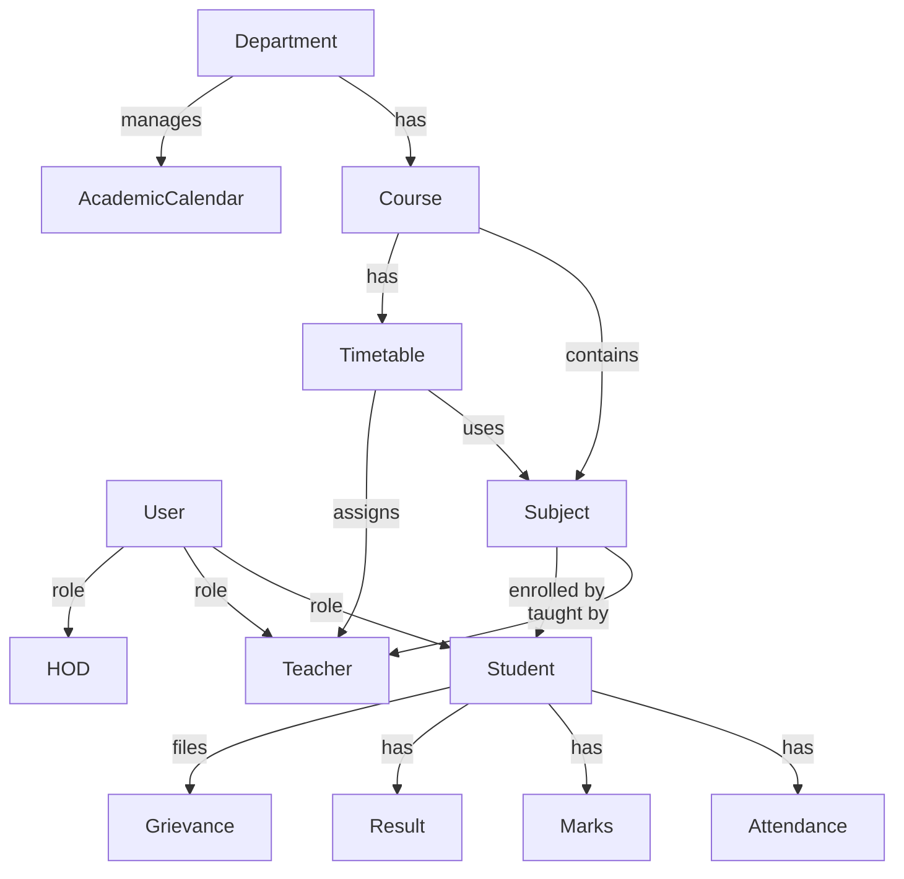

# 📊 Database Models Documentation

## Overview

This directory contains all Mongoose schemas for the UniFlux platform. Each model represents a core entity in the university management system with proper validation, indexes, and business logic.

## 📁 Models Structure

```
models/
├── User.js                 # Base user model with role-based authentication
├── Student.js             # Student-specific information
├── Teacher.js             # Teacher/Faculty information
├── Department.js          # Academic departments
├── Course.js              # Academic programs/courses
├── Subject.js             # Subjects/courses within programs
├── Attendance.js          # Student attendance tracking
├── Marks.js               # Student marks and grades
├── Result.js              # Semester results with SGPA/CGPA
├── Timetable.js           # Class schedules and timetables
├── Grievance.js           # Student grievances and complaints
├── Notice.js              # University/department notices
├── AcademicCalendar.js    # Academic events and calendar
└── index.js               # Central export file
```

## 🔐 Core Models

### 1. User Model
**File**: `User.js`

Base authentication model for all users in the system.

**Key Fields**:
- `name`, `email`, `password`
- `role`: ['superadmin', 'hod', 'teacher', 'student']
- `department`, `registrationNo`, `rollNumber`
- Password hashing with bcrypt
- JWT token generation

**Methods**:
- `comparePassword()`: Verify user password
- Pre-save middleware for password hashing

---

### 2. Department Model
**File**: `Department.js`  
**Status**: ✅ Newly Created

Represents academic departments within the university.

**Key Fields**:
- `name`: Department name (unique)
- `code`: Department code (unique, uppercase)
- `hodId`: Reference to HOD (User)
- `description`: Department description
- `establishedYear`: Year of establishment
- `isActive`: Active status

**Indexes**:
- `code` (unique)
- `name` (unique)
- `isActive`

**Methods**:
- `getActiveCourses()`: Get all active courses
- `findByCode()`: Find department by code

---

### 3. Course Model
**File**: `Course.js`  
**Status**: ✅ Newly Created

Represents academic programs (B.Tech, M.Tech, etc.).

**Key Fields**:
- `name`: Course name
- `code`: Course code (unique, uppercase)
- `department`: Reference to Department
- `duration`: Duration in years
- `totalSemesters`: Total number of semesters
- `description`: Course description
- `isActive`: Active status

**Indexes**:
- `code` (unique)
- `department`
- `isActive`

**Methods**:
- `getSubjectsBySemester()`: Get subjects for a semester
- `findByCode()`: Find course by code

**Virtuals**:
- `subjects`: All subjects in the course

---

### 4. Subject Model
**File**: `Subject.js`

Individual subjects/courses offered.

**Key Fields**:
- `code`: Subject code (unique)
- `name`: Subject name
- `semester`: Semester number
- `teacherId`: Assigned teacher
- `department`: Department name
- `credits`: Credit hours

**Indexes**:
- `code` (unique)

**Status**: ⚠️ Needs enhancement (should reference Course and Teacher models)

---

### 5. Attendance Model
**File**: `Attendance.js`

Tracks student attendance for each subject.

**Key Fields**:
- `studentId`: Student identifier
- `subjectId`: Subject identifier
- `date`: Attendance date
- `status`: ['present', 'absent']
- `teacherId`: Teacher who marked attendance

**Indexes**:
- Compound: `studentId`, `subjectId`, `date` (unique)

**Status**: ⚠️ Needs enhancement (should reference User and Subject models, add 'late' and 'excused' statuses)

---

### 6. Marks Model
**File**: `Marks.js`

Stores student marks for subjects.

**Key Fields**:
- `studentId`: Student identifier
- `subjectId`: Subject identifier
- `internalMarks`: Internal assessment (max: 50)
- `externalMarks`: External exam (max: 100)
- `totalMarks`: Total (max: 150)
- `grade`: Letter grade
- `semester`: Semester number

**Indexes**:
- Compound: `studentId`, `subjectId` (unique)

**Status**: ⚠️ Needs enhancement (should match specification with internal breakdown, approval workflow)

---

### 7. Result Model
**File**: `Result.js`  
**Status**: ✅ Newly Created

Semester-wise consolidated results.

**Key Fields**:
- `student`: Reference to User
- `semester`: Semester number
- `course`: Reference to Course
- `subjects`: Array of Marks references
- `sgpa`: Semester GPA
- `cgpa`: Cumulative GPA
- `percentage`: Percentage score
- `status`: ['pass', 'fail', 'pending']
- `isPublished`: Publication status

**Indexes**:
- Compound: `student`, `semester` (unique)
- `course`, `semester`
- `isPublished`

**Methods**:
- `calculateSGPA()`: Auto-calculate SGPA
- `getGradePoint()`: Convert grade to points
- `calculateCGPA()`: Static method for CGPA

**Virtuals**:
- `gradeClass`: Classification (Outstanding, Excellent, etc.)

---

### 8. Timetable Model
**File**: `Timetable.js`  
**Status**: ✅ Newly Created

Class schedules and timetables.

**Key Fields**:
- `course`: Reference to Course
- `semester`: Semester number
- `dayOfWeek`: ['monday', 'tuesday', etc.]
- `timeSlot`: { startTime, endTime }
- `subject`: Reference to Subject
- `teacher`: Reference to User
- `classroom`: Room number/name
- `type`: ['lecture', 'lab', 'tutorial']
- `isActive`: Active status

**Indexes**:
- Compound: `course`, `semester`, `dayOfWeek`, `timeSlot.startTime` (unique)
- Teacher schedule conflicts
- Classroom conflicts

**Methods**:
- `checkTeacherConflict()`: Detect teacher scheduling conflicts
- `checkClassroomConflict()`: Detect room conflicts
- `getCourseTimetable()`: Get timetable for course/semester
- `getTeacherSchedule()`: Get teacher's schedule

**Virtuals**:
- `durationMinutes`: Class duration

---

### 9. Grievance Model
**File**: `Grievance.js`

Student grievances and complaint tracking.

**Key Fields**:
- `student`: Student identifier
- `title`: Grievance title
- `description`: Detailed description
- `category`: Grievance category
- `status`: ['open', 'in-progress', 'resolved', 'closed']
- `priority`: ['low', 'medium', 'high']

**Indexes**:
- `student`
- `status`

---

### 10. Notice Model
**File**: `Notice.js`

University and department notices.

**Key Fields**:
- `title`: Notice title
- `content`: Notice content
- `author`: Author identifier
- `department`: Target department
- `priority`: Priority level
- `publishedDate`: Publication date

**Indexes**:
- `department`
- `publishedDate`

---

### 11. AcademicCalendar Model
**File**: `AcademicCalendar.js`  
**Status**: ✅ Newly Created

Academic events and calendar management.

**Key Fields**:
- `title`: Event title
- `description`: Event description
- `eventType`: ['holiday', 'exam', 'deadline', 'event', 'semester-start', 'semester-end']
- `startDate`: Event start date
- `endDate`: Event end date (optional)
- `department`: Department (null for university-wide)
- `semester`: Semester (optional)
- `isRecurring`: Recurring event flag
- `recurringPattern`: Pattern details
- `notifyUsers`: Notification flag
- `color`: Display color (hex)
- `isActive`: Active status

**Indexes**:
- `startDate`, `endDate`
- `eventType`
- `department`
- `isActive`

**Methods**:
- `affectsDepartment()`: Check if event affects department
- `getEventsInRange()`: Get events in date range
- `getUpcomingEvents()`: Get upcoming events
- `getEventsByType()`: Filter by event type

**Virtuals**:
- `durationDays`: Event duration
- `isOngoing`: Check if currently happening
- `isUpcoming`: Check if future event
- `isPast`: Check if past event

---

## 📚 Additional Models (Future)

### Student Model
**File**: `Student.js`

Extended student information beyond User model.

**Key Fields**:
- `name`, `email`, `rollNumber`, `registrationNo`
- `department`, `semester`, `cgpa`
- `avatar`

**Status**: ✅ Exists but could be merged with User model

---

### Teacher Model
**File**: `Teacher.js`

Extended teacher/faculty information.

**Key Fields**:
- `name`, `email`, `employeeId`
- `department`, `qualification`, `specialization`

**Status**: ✅ Exists but could be merged with User model

---

## 🔗 Model Relationships



---

## 🛠️ Usage Examples

### Import Models

```javascript
// Import all models
import {
  User,
  Department,
  Course,
  Subject,
  Attendance,
  Marks,
  Result,
  Timetable,
  Grievance,
  Notice,
  AcademicCalendar
} from './models/index.js';

// Or import individually
import User from './models/User.js';
import Department from './models/Department.js';
```

### Create a Department

```javascript
const department = await Department.create({
  name: 'Computer Science Engineering',
  code: 'CSE',
  description: 'Department of Computer Science and Engineering',
  establishedYear: 2005,
  isActive: true
});
```

### Create a Course

```javascript
const course = await Course.create({
  name: 'B.Tech Computer Science',
  code: 'BTECHCSE',
  department: departmentId,
  duration: 4,
  totalSemesters: 8,
  description: 'Bachelor of Technology in Computer Science'
});
```

### Create Timetable Entry

```javascript
const timetableEntry = await Timetable.create({
  course: courseId,
  semester: 5,
  dayOfWeek: 'monday',
  timeSlot: {
    startTime: '09:00',
    endTime: '10:00'
  },
  subject: subjectId,
  teacher: teacherId,
  classroom: 'Room 101',
  type: 'lecture'
});
```

### Check Teacher Conflicts

```javascript
const hasConflict = await Timetable.checkTeacherConflict(
  teacherId,
  'monday',
  '09:00',
  '10:00'
);
```

### Get Upcoming Events

```javascript
const events = await AcademicCalendar.getUpcomingEvents(10, departmentId);
```

---

## ✅ Completed Features

- ✅ User authentication model with roles
- ✅ Department management
- ✅ Course/Program management
- ✅ Subject management
- ✅ Attendance tracking (basic)
- ✅ Marks and grading (basic)
- ✅ Result calculation with SGPA/CGPA
- ✅ Timetable with conflict detection
- ✅ Grievance tracking
- ✅ Notice board
- ✅ Academic calendar with recurring events

---

## 🔄 Models Needing Enhancement

### Attendance Model
- [ ] Use ObjectId references instead of strings
- [ ] Add 'late' and 'excused' status options
- [ ] Add `markedBy` reference to User
- [ ] Add `remarks` field

### Marks Model
- [ ] Use ObjectId references
- [ ] Break down internal marks (test1, test2, assignment)
- [ ] Add approval workflow fields
- [ ] Add `approvedBy` and `enteredBy` references

### Subject Model
- [ ] Reference Course instead of storing course data
- [ ] Reference Teacher (User) instead of string ID
- [ ] Add `maxMarks` object for internal/external
- [ ] Add `type` enum (theory/practical/lab)

---

## 🔒 Security Features

- Password hashing with bcryptjs
- Unique constraints on sensitive fields
- Input validation and sanitization
- Reference integrity with ObjectIds
- Index optimization for queries

---

## 📈 Performance Optimization

- Strategic compound indexes
- Virtual fields for computed properties
- Static methods for complex queries
- Pre-save hooks for auto-calculations

---

## 🧪 Testing

Test all models before use:

```javascript
// Test Department model
const dept = await Department.create({ /* data */ });
console.log(dept.getActiveCourses());

// Test timetable conflicts
const conflict = await Timetable.checkTeacherConflict(/* params */);
```

---

## 📝 Notes

- All models use ES6 `import/export` syntax
- Timestamps (`createdAt`, `updatedAt`) enabled on all models
- Virtuals enabled in JSON/Object output
- Proper error messages in validation
- Indexes optimized for common queries

---

**Last Updated**: January 7, 2026  
**Status**: Core models implemented, some need enhancement  
**Next Steps**: Enhance existing models, add validation middleware, create seeder scripts
